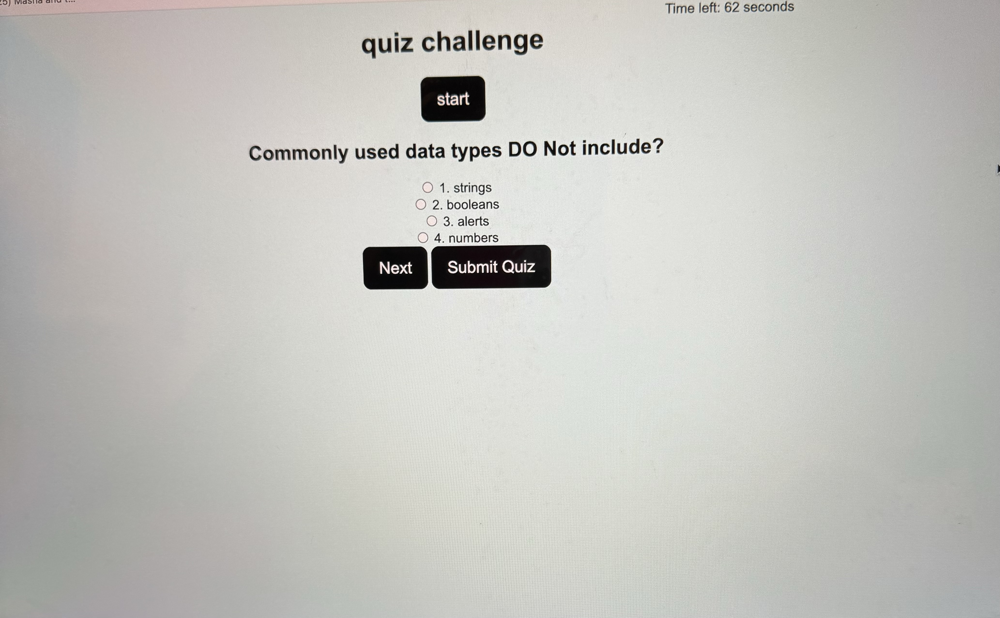

# My-Portfolio

This challenge was a good way of getting comfortable with many factors that we have learned in class. Getting comfortable wiht JavaScript and css and index.HTML. 

## Features
    The quiz contains questions, answers, and a timer to keep track of how long it takes the user to finish the quiz. The user will have a maximum time of 75 seconds to finish the quiz that contains 4 questions.

## usuage
    This was a good way of getting practice on how to make a quiz, this was a good way of creating a good dinky app that functions at the best of my knowledge. 

###
    Technology that was used for this portfolio was HTML, CSS, reset.css, javaScript and GitHub.

[Do visit my page](https://github.com/johria123/module-4HW)